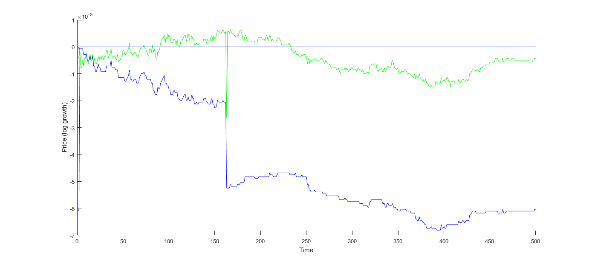
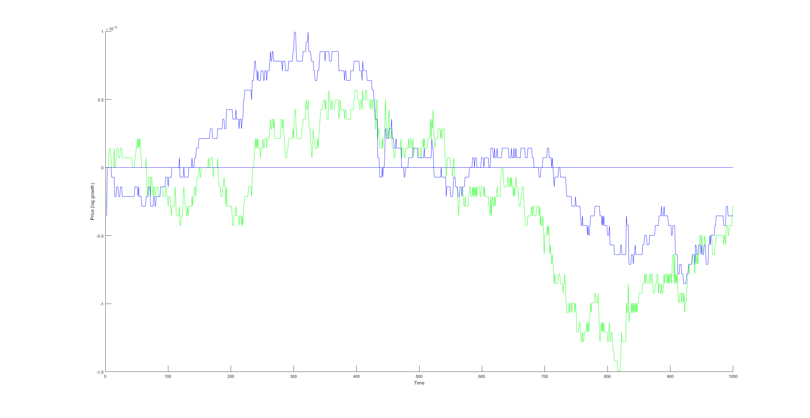
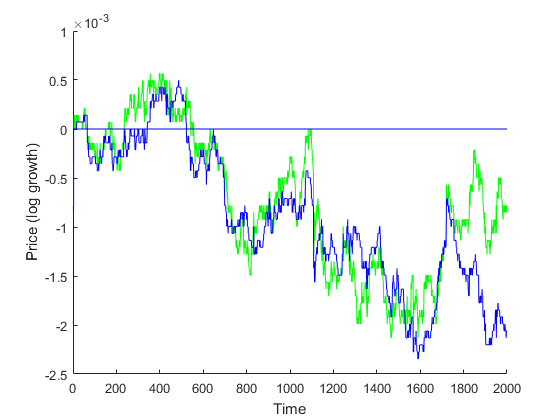

ECON136 Final Project
----------------
*Nate Diamant, Jeffrey Rutledge, Kyle Suver, Daniel Gorelik*

*May 2, 2018*

Github repository of project code:

<https://github.com/ndiamant/econ136_final_project>

____________________

## Introduction
Our project's goal is to evaluate the viability of modeling short
term stock price patterns using a gaussian process with a trained
spectral kernel. This work was inspired by previous work using a
gaussian process with an RBF kernel to perform portfolio
optimization. The portfolio optimization was performed using daily
data. The trained gaussian process was used to predict the price of
the stocks over the next day which would be used to rebalance the
portfolio.

In this project we fit a gaussian process with a spectral kernel to
minute data. The goal is to predict the price in the next couple of
minutes. Then sell or retain the stock based on the prediction.

We believe the spectral kernel has better potential than the RBF
kernel to predict future stock prices. The RBF kernel determines the
covariance between data points based on their gaussian distance. A
gaussian process using an RBF kernel is essentially limited to
creating a model that thinks previous data's relevance to future data
is entirely determined by the closeness. The spectral kernel allows
for periodicity in the data. This allows a gaussian process trained
using spectral kernel to think the process generating the data has
some kind of periodicity. Meaning that a previous point at some time
period away may be more relevant than a close point. This spectral
kernel is trained using some kind of numerical optimization to
maximize likelihood.

## Back Testing
We have also implemented a very simple strategy to perform some back
tests. First, we train the kernel on some historical data and then we
save the kernel for future use. This is necessary because training the
kernel takes a couple minutes. Then we use this kernel and the past
data to predict how the stock price will change in the next minute. If
we predict it will rise we retain our stock, and if we predict it
falls we will sell the stock.

This trading strategy is neither practical or optimal and is used for
its simplicity. The model is not practical because moving your entire
holding of the stock every minute is going to have a strong impact of market
friction. The model is not optimal because it only uses a small
amount of the model's prediction. A better model would probably be to
use the model's prediction over the next several minutes and
incorporate the model's confidence in its predictions.

Below are some examples of the log return ratio of this strategy in
action. [^1] (If you start with `x` dollars and the final log return ratio
was `r` then you would end with `exp(r) * x` dollars.) The `y`-axis is
the log return ratio and the `x`-axis is minutes. The blue line is the
performance of the simple trading strategy proposed above, and the green
line is holding the assets the entire time, i. e. the market's performance.

\

The above plot was a trial run of the back test code to see if it
functioned well, so the kernel was only trained on 50 minutes of
previous data. Therefore, the kernel is unlikely to have fit the
patterns well and the run will probably under perform. However, the
plot is till interesting because it reveals a potential flaw in the
model. At one of the minutes the stock had a sudden unexpected
drop. Our model didn't predict this, which is not surprising because
the training data didn't contain any of these patterns, so it stayed
in the stock. However, after it crashed the model predicted it would
continue and so sold the stock. Ultimately, causing a huge loss.

This suggests that the model needs some kind of filter to catch events
like this. The model probably had a really low confidence in its
prediction after the sudden crash, which would be useful for
constructing the filter.

\

The above plot shows an example of back testing with the kernel
trained on a more reasonable amount of historical data, 500
minutes. Although, the model ends just about even the market there are
two regions where it strongly outperforms the market. This suggests
that with an improved trading strategy the model has the potential to
beat the market.

\

The above plot shows an example of back testing with the kernel
trained on a more reasonable amount of historical data, 500
minutes. This one shows how the model performs over 2000 minutes
instead of the 1000 shown above. The model's performance seems to
degrade significantly in the latter 1000 minutes which suggests that
the kernel may need to be periodically retrained to learn relevant
local patterns.

## Conclusion
We believe the above data warrants further investigation. Considering
that the simple trading strategy used to back test doesn't even utilize all of the
model's information, but still has the ability to outperform the
market, suggests that an improved trading strategy may be consistently
profitable. Furthermore, there are many hyperparameter that could be
tuned to potentially improve the spectral kernel learning.

## References
Andrew Gordon Wilson and Ryan Prescott Adams.
Gaussian process kernels for pattern discovery and extrapolation.
International Conference on Machine Learning (ICML), 2013.
<http://jmlr.org/proceedings/papers/v28/wilson13.pdf>

[^1]: We had trouble getting the gradient descent algorithm to learn
    the kernel well so these plots were generated using the code at
    <https://people.orie.cornell.edu/andrew/code/> which uses a
    nonlinear conjugate gradient method.
